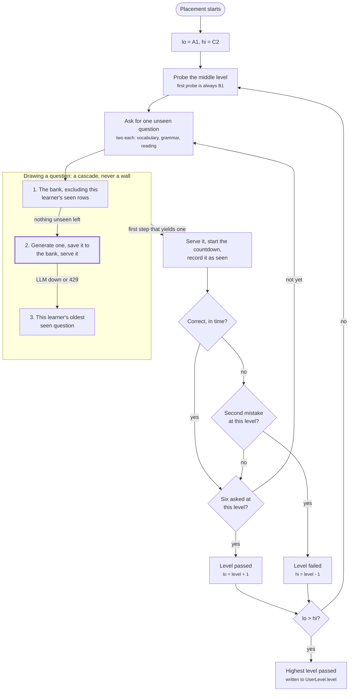
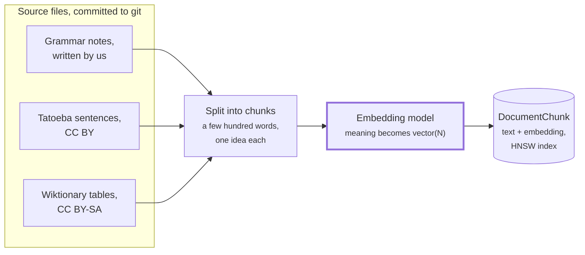
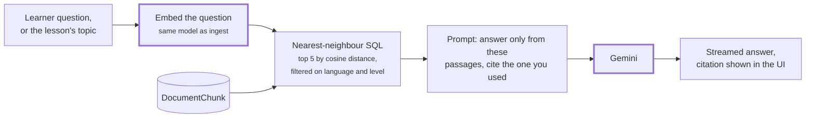
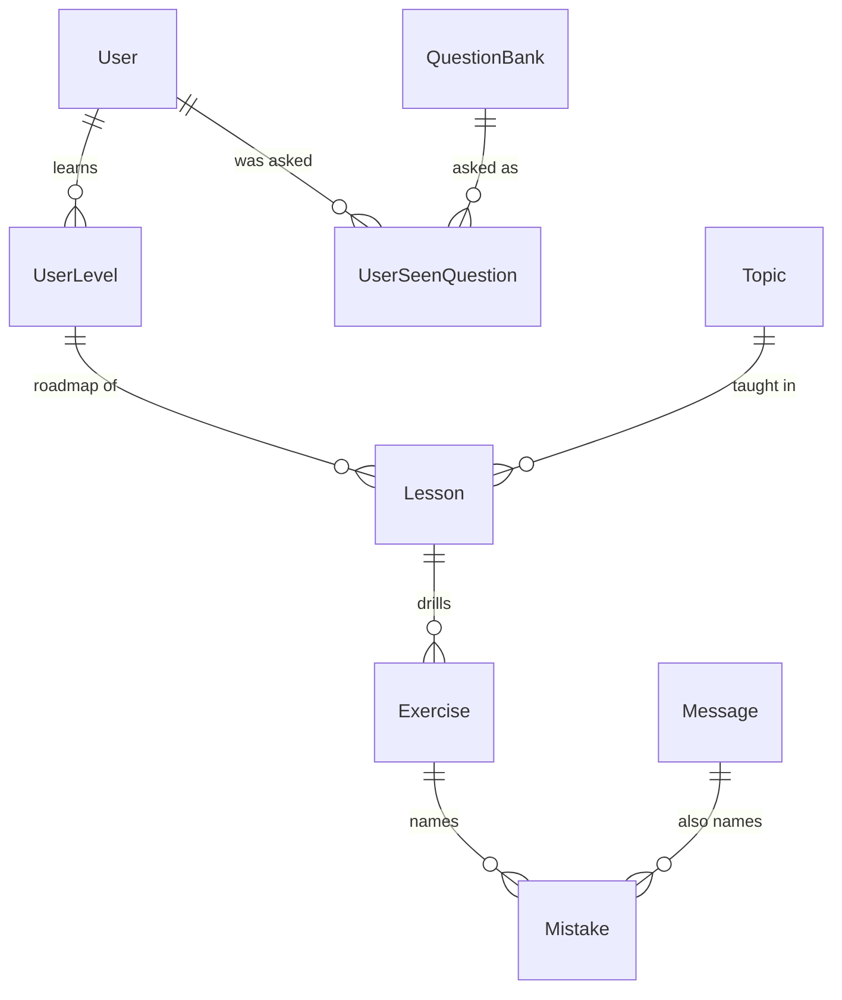
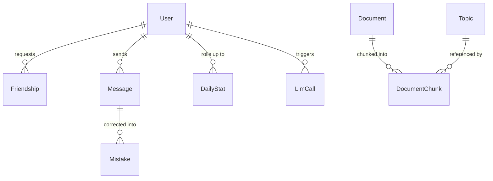

# Product Architecture

The product, the modules, the AI layer and the schema. [TECHNICAL_PLAN.md](TECHNICAL_PLAN.md)
covers the infrastructure around it: repository layout, containers, CI and build order.

The subject lists this project by name in chapter V.6:

> **Language Learning Platform**: Lessons, exercises, progress tracking, and peer practice.
> Point potential: 15+ points.

---

## 1. The learner journey

The product is one loop, repeated. Everything in this document exists to serve it.

```
sign up / log in  →  onboarding  →  placement  →  syllabus  →  lesson  →  syllabus …
                     (2 questions)  (binary search) (topic tiles)  (teach → drill → score)
```

| Step | What the learner sees | What the system does |
|---|---|---|
| **Onboarding** | Two questions: which language to learn, and a daily goal (10, 15, 30 or 60 minutes) | Creates a `UserLevel` row. `level` stays null until placement sets it. No AI call. |
| **Placement** | One question at a time, each with its own countdown. Skippable by a learner who already knows their level | Binary search over the six CEFR levels, in **our code**. Questions are multiple choice, so scoring is a string comparison, and the LLM is called only when the bank has nothing unseen left. Writes `UserLevel.level`. See §1.2 |
| **Syllabus** | A board of topic tiles in order, locked until the one before is done | Selects `Topic` rows from the seeded catalogue for (language, level), writes one `Lesson` row per topic. No AI call. |
| **Lesson** | Tutor explains the topic, shows examples, then drills exercises one at a time. Each answer comes back corrected, with the mistakes named | Explanation is RAG-grounded and streamed. Each exercise and each correction is a structured JSON call. |
| **Result** | Mastery score, mistakes to review, next topic unlocked | Score computed **in code** from the `Exercise` rows. No AI call. |

### The rule that makes this work

> **The LLM generates and judges individual items. Our code owns state, scoring and
> progression.**

This is the spine of the whole design, and it is worth defending in one place because every
other decision follows from it:

- **It is explainable.** The subject requires you to explain your AI implementation at
  evaluation. "A binary search over the six CEFR levels, six questions per level, a second
  mistake ends the level" is explainable in one breath. "We asked the model to decide the level"
  is not.
- **It is testable.** With `LLM_PROVIDER=fixture` the entire progression is deterministic and
  unit-testable. Ask the LLM to own progression and nothing is testable without spending money.
- **It is cheap.** Selecting topics, computing mastery, unlocking the next tile, none of that
  needs a token.
- **It cannot embarrass you in a demo.** A model that decides to award B2 for a blank answer is
  a live failure. A binary search in TypeScript cannot.

### 1.2 Placement is a binary search, and never the same question twice

A placement run answers exactly one question: which of the six CEFR levels is this learner at.
It is a search in our code, not a judgment by the model.

**The search.** Keep the range of levels still possible, `lo = A1` and `hi = C2`, and probe the
middle of it. The first probe is therefore always B1.

- **Level passed:** everything above is still in play, so `lo = level + 1`.
- **Level failed:** everything below it is, so `hi = level - 1`.
- **`lo > hi`:** the search is over. The result is the highest level passed, or A1 if none was.

Three probes settle six levels, so a run is at most three levels deep.

**A worked run.** B1 is always the first probe. Six questions there, one of them wrong: that is
still a pass, so `lo` becomes B2 and the next probe is the middle of B2 to C2, which is **C1**.
Two wrong at C1: the level stops there, `hi` becomes B2, and the last probe is B2 itself. The
answer is B2 if it passes and B1 if it does not.

**What passing a level means.** Six questions at that level, two from each category:
`vocabulary`, `grammar` and `reading`. **One mistake is allowed; the second ends the level.**
A learner who is out of their depth stops after two questions instead of sitting through six,
and a single slip does not cost them a level.

Every question carries its own countdown (`QuestionBank.timeLimitS`), and running out of time
counts as a wrong answer. Without that, a stalled tab is an unbounded test.

**Drawing a question is a cascade, never a wall.** Every step draws from one cell, the
`(lang, level, category)` being probed, so a French B1 grammar probe can only ever serve a French
B1 grammar question:

1. **The bank**, excluding everything this learner has already been served (`UserSeenQuestion`).
2. **Nothing unseen left in the cell, so generate one.** A structured LLM call, schema-validated,
   written to `QuestionBank` with no `sourceId`, then served. It stays, so the next learner to
   reach that cell gets it from step 1. **The bank grows as it is used**, and a null `sourceId`
   is what marks the rows no human reviewed.
3. **Generation failed** (API down or rate limited): serve the oldest question this learner has
   seen in that cell. This is the one path that repeats a question, and it opens only while the
   LLM is unreachable. A repeat after months is a weak measurement, and an abandoned exam is no
   measurement at all.

Bank first rather than generate every time buys three things. **Quality:** a seeded question was
reviewed by a human once, a live one cannot be. **Cost:** near zero on the common path.
**Provability:** the exclusion is a `NOT EXISTS` over `UserSeenQuestion`, not a hope about
sampling temperature.

**Skipping and retaking.** A learner who already knows their level skips the exam and sets
`UserLevel.level` directly. A retake is the same search run again, drawing against the same
`UserSeenQuestion` rows, so it asks new questions unless step 3 fires. The result overwrites
`UserLevel.level`. Only the current level is stored, never a history of runs.

**The run itself is not a table.** The bounds, the level being probed, the tally per category and
the mistakes so far live in Redis for the length of the exam (§4). Two things outlive it: the
`UserSeenQuestion` rows, and the final level.

**The whole run, drawn.** A thick border is an LLM call. There is one, and it is reached only
when a learner has exhausted a cell.



### 1.3 The daily goal shapes the session, never the syllabus

Picked at onboarding, changeable in settings. It does exactly two things:

- **Sizes "today's plan".** The dashboard proposes the next lesson and reviews whose
  `Topic.estimatedMinutes` fit inside the goal, so a 10-minute learner sees one short drill and
  a 60-minute learner sees a full lesson plus reviews.
- **Defines the streak.** A day joins the streak when `DailyStat.minutesActive` reaches the
  goal. That is the gamification module's raw material.

What it must never do is gate content. A learner past their goal keeps going if they want; it
is a target, not a cap, and a cap would punish exactly the behaviour the product exists for.

### 1.4 Anatomy of a lesson, and where RAG runs in it

The walkthrough for a learner with a 10-minute goal who opens "passé composé":

| Minute | What the learner sees | What the system does |
|---|---|---|
| 0:00 | Clicks the topic tile | Creates the `Lesson` row. No AI call |
| 0:01 | The intro streams in, with a "source" citation | **Cache lookup first.** On a hit, the explanation replays from Redis: no retrieval, no LLM, no cost. On a miss: retrieve top-k chunks filtered on `(language, level, topicId)`, stream the grounded explanation, cache it for everyone |
| ~2:30 | First exercise appears | The exercise set was generated once per `(topic, level, seed)` as structured calls and cached the same way. Retrieved example sentences may serve as raw material at generation time |
| each answer | The correction, with the mistakes named | One structured call: `{ correct, mistakes[], correctedText }`. **No retrieval here**: the learner is waiting, and judging an answer against its expected answer needs no reference passages |
| ~9:30 | "Daily goal reached" and the streak day lands | `DailyStat.minutesActive` crossed 10. The lesson keeps going if the learner does; the goal never gates |
| whenever | Learner leaves mid-lesson | `Lesson.status` stays in progress and each answered `Exercise` row is already saved, so tomorrow resumes at the next unanswered one |
| end | Mastery score, next tile unlocks | Computed in code from the `Exercise` rows. No AI call |

So RAG runs in exactly three places, and two of them are invisible:

1. **Grounding the explanation**, on cache miss only. The first learner ever to open a B1
   passé composé lesson pays the retrieval and the generation; everyone after replays the cache.
2. **Sourcing exercise generation**, same cache-miss timing: retrieved level-graded sentences
   make better raw material than the model's imagination.
3. **"Ask the tutor"**, the free-form question box. The only interactive retrieval, because the
   question is different every time and cannot be cached.

Retrieval is a server-side step inside prompt assembly. The learner never sees it, except as the
citation under the explanation, which is also how the RAG module demonstrates itself at
evaluation.

### 1.5 The second mode: cross-language chat

The tutor is one half of the product. The other is two learners talking to each other, each in
their own language, with the AI in the middle.

```
Anna (de) types   "Ich bin gestern nach Berlin gefahren."
                            |
                            +-- corrected for Anna, her own mistakes named
                            +-- translated for Luc:  "Je suis allé à Berlin hier."
```

Anna never leaves German, Luc never leaves French, and both are reading real language written by
a real person rather than generated practice text. It is the feature that makes this a platform
rather than a quiz app, and it is what earns the real-time module: two clients, one shared
conversation, updates neither of them asked for.

Three things fall out of it:

**One LLM call per message, not two.** Correcting the sender and translating for the recipient is
a single structured call returning `{ corrected, mistakes[], translated }`. Two calls would double
the cost and the latency for no gain.

**The message sends before the AI answers.** `translated` and `correctedBody` are nullable and
filled when the call returns. A rate-limited or slow model must delay the translation, never the
message: a chat that blocks on an API is not a chat.

**Chat mistakes count.** The corrections here produce the same `Mistake` rows a lesson exercise
does, so "60% of your errors are verb agreement" covers how the learner actually writes, not only
how they answer drills. That is why `Mistake` hangs off either an exercise or a message.

This is also the strongest candidate if you ever need a **Modules of choice** entry: real-time
cross-language conversation with inline correction is substantial, and easy to justify.

---

## 2. Modules and points

14 required, bonus capped at +5, so **19 is the maximum that can count**. Anything beyond that
is insurance against a module failing on the day.

### Core, build these, in this order

| Module | Type | Pts | Status |
|---|---|---|---|
| Framework for frontend and backend | Major | 2 | done (Next.js + NestJS) |
| ORM | Minor | 1 | done (Prisma 7) |
| Standard user management | Major | 2 | partly done, profile, avatar, friends, online status |
| Complete 2FA | Minor | 1 | done |
| i18n, ≥3 languages | Minor | 1 | locales declared, `next-intl` not wired |
| Additional browsers (≥2) | Minor | 1 | Playwright projects + documentation |
| Complete LLM interface | Major | 2 | interface exists, no provider |
| Real-time via WebSockets | Major | 2 | route reserved, no gateway |
| Complete RAG system | Major | 2 | pgvector installed, no corpus |
| User interaction: chat, profiles, friends | Major | 2 | not started |
| | | **16** | |

### Buffer, pick from these once the core is green

| Module | Type | Pts | Why it fits |
|---|---|---|---|
| SSR | Minor | 1 | App Router already server-renders; needs deliberate proof (see §9) |
| Advanced search | Minor | 1 | Filter/sort/paginate topics, vocabulary, own mistake history |
| User activity analytics dashboard | Minor | 1 | `DailyStat` and `Mistake` already exist for progress tracking |
| Gamification | Minor | 1 | Streaks, XP, badges. **Check with staff**: it sits in the gaming chapter but, unlike its four neighbours, carries no "requires a game" note |
| Custom design system (≥10 components) | Minor | 1 | `packages/ui` is already the place |
| Notification system | Minor | 1 | Needs the socket layer, which the core already builds |
| Public API | Major | 2 | Swagger + throttler already in the stack; needs API keys and 5 documented endpoints |
| Advanced analytics dashboard | Major | 2 | Charts, real-time, CSV/PDF export, a superset of the minor one |

Core 16 + four cheap minors ≈ **20 claimable**, one point of slack above the 19 ceiling and six
above the 14 floor. That is the target.

**Explicitly out**: OAuth, RTL, every gaming module, WAF/Vault, ELK, Prometheus, microservices,
blockchain, file upload, PWA, WCAG AA, voice, image recognition.

---

## 3. Transport: what is REST and what is a WebSocket

This is the question that decides the shape of the codebase, so it gets a straight answer.

**Most of this product is request/response.** Onboarding, syllabus, starting a lesson, submitting
an answer, reading progress, all of that is HTTP. A tutor that answers one learner is not
"real-time" in the sense the subject means; the module asks for *"real-time updates across
clients"* and *"handle connection/disconnection gracefully"*, which is a multi-client claim.

So the socket layer has to earn its keep on genuinely multi-client surfaces. It does, on four:

| Surface | Why it must be a socket | Serves module |
|---|---|---|
| **Cross-language chat**, each learner writing their own language, the AI translating and correcting between them (§1.5) | Two clients, one conversation, sub-second echo | Real-time (Major) |
| **Chat** | Same | User interaction (Major) |
| **Presence**, friends' online status | Server pushes state changes nobody polled for | User management (Major) |
| **Notifications** | Same | Notification system (Minor) |

**Tutor token streaming rides on the same socket.** Not because it must, Server-Sent Events
would do, but because a second transport means a second authentication path, a second
reconnection story and a second cancellation path, for no gain. One gateway, one handshake, one
`disconnect` handler is less code and a much shorter answer at evaluation.

### The split

| | Transport | Examples |
|---|---|---|
| **Everything CRUD** | REST, Nest controllers, documented in Swagger | `POST /api/enrollments`, `GET /api/syllabus/:id`, `POST /api/lessons/:id/attempts`, `GET /api/progress` |
| **Everything live** | socket.io on `/ws` | `tutor:stream`, `session:join`, `chat:send`, `presence:update`, `notification:new` |

The REST half is also what the **Public API** module documents, if you take it. That is a
reason to keep the domain reachable over HTTP even where a socket would do.

### Gateway rules

The contract already exists in [packages/shared/src/events/socket.ts](../packages/shared/src/events/socket.ts) -
event names, Zod payload schemas, `ServerToClientEvents` / `ClientToServerEvents`, `SocketData`.
Use it. Four rules:

1. **Mount with `path`, not `namespace`.** `path` is the HTTP endpoint engine.io listens on;
   `namespace` is a logical channel multiplexed over it. The Caddyfile routes `/ws/*` to the
   api, so the gateway is `@WebSocketGateway({ path: '/ws' })` and the client is
   `io({ path: '/ws' })`. Namespaces are for later, when tutor and chat want separating.
2. **Authenticate the handshake.** A guard reads the same signed session cookie the REST side
   uses, same origin, so the cookie is sent automatically, and populates
   `SocketData { userId, locale }`. An unauthenticated socket is disconnected, not tolerated.
3. **Parse every inbound payload with the shared Zod schema.** `CLIENT_EVENT_SCHEMAS` exists for
   this. Anything arriving on a gateway is untrusted, including from our own client.
4. **Rate-limit per socket.** `@nestjs/throttler`'s guard is HTTP-only; socket events bypass it
   entirely. See §7.

---

## 4. Redis: six distinct jobs

Redis is already in the stack. It is not one thing, it is six, and they have different
lifetimes:

| Job | Why Redis and not Postgres | Status |
|---|---|---|
| **Session store** (`connect-redis`) | Sessions are hot, short-lived and disposable. Restarting the api must not log everyone out | in use |
| **Throttler counters** | Per-minute counters with a TTL | not yet: `@nestjs/throttler` runs without a storage adapter, so counters are in process memory. Wire one in before a second api replica |
| **LLM response cache** | Keyed `(language, level, topic, seed, locale)`. The same B1 *passé composé* explanation is generated once and served to everyone. The single biggest cost lever in the project | to build |
| **Per-user token budget** | An atomic counter with a daily TTL, checked by a guard before any LLM call | to build |
| **Presence** | `SETEX user:{id}:online` refreshed by socket heartbeat. Expiry *is* the disconnect detection, including for a client that vanished without a `disconnect` | to build |
| **Placement run state** | The search bounds, the level being probed, the tally per category, the mistakes so far and the current question's deadline. It lives exactly as long as the exam, so a table would be a row deleted minutes after it was written. Expiry doubles as the abandoned-exam cleanup | to build |

---

## 5. The AI layer

### Provider

`LLM_PROVIDER` stays `fixture | cached | real`, and CI stays on `fixture` forever. The vendor is
one file behind the `LlmProvider` interface. Team decision: **Gemini 3.1 Flash-Lite**, chosen
for native JSON-schema output and price.

Verified 2026-08-22: the model has a real free tier, roughly 30 requests/minute and 1,500/day
per key, and on the free tier **Google may use prompts and outputs for training and human
review**. Paid tiers are not used for training. That one clause has three consequences:

1. **The Privacy Policy must say it.** Learner-typed text (answers, tutor chat) is sent to
   Google and may be used to train models. The Privacy Policy is a rejection criterion in its own
   right. Disclose it now, or budget for the paid tier where
   the clause does not apply; at our volume the paid cost is a few tens of euros for the whole
   project.
2. **Never put identity in a prompt.** Email, display name and user id have no business in any
   prompt. The tutor needs the level, the topic and the learner's answer text, nothing else.
3. **30 RPM is a platform-wide ceiling on one key.** The Redis exercise cache and the per-user
   budget guard stop being cost optimisations and become what keeps a multi-user demo alive.
   The provider should catch a 429 and degrade to `cached` rather than surface an error
   mid-lesson.

Still to record in [VERSIONS.md](VERSIONS.md) before the first real call:

1. **Pin the exact model id**, the dated snapshot, not the floating alias: a silently rotated
   model changes behaviour under a green test suite.
2. **Pin the embedding model and its dimension separately.** The vector column's dimension is
   fixed in a migration; changing the embedding model later means re-embedding the whole corpus
   and a new migration.
3. **Key hygiene.** The key lives in `.env` as `LLM_API_KEY` and nowhere else. A key that has
   been pasted into a chat, a doc or a ticket is burned: rotate it. gitleaks guards commits,
   not conversations.

### Two call shapes, not one

Structured output and streaming pull in opposite directions, you cannot validate JSON until it
is complete. Resolve it in the interface rather than in every call site:

```ts
interface LlmProvider {
  // Validated JSON. Used for placement items, exercises, corrections, judgments.
  // The Zod schema comes from @ft/shared and is also what the client parses.
  generateStructured<T>(req: StructuredRequest<T>): Promise<T>;

  // Prose, token by token. Used for the tutor's explanation and for peer-practice hints.
  streamText(req: TextRequest): AsyncIterable<string>;
}
```

Which shape each step uses:

| Step | Shape | Why |
|---|---|---|
| Placement item | structured | It has fields: prompt, skill, target level |
| Topic explanation | **stream** | It is prose, and watching it appear is the demo |
| Exercise generation | structured | Rendered as a form, not as text |
| Answer correction | structured | `{ correctedText, mistakes[], encouragement }`, the mistakes drive analytics |
| Lesson summary | computed in code | Not an LLM call at all |

Every structured response is parsed with the **same Zod schema the client uses**. That is what
`packages/shared` is for, and it satisfies the mandatory "validated on both sides" requirement
for free.

### RAG, and what the corpus actually is

The module wants *"a large dataset"*, *"users can ask questions and get relevant answers"*,
*"proper context retrieval and response generation"*. For this product the corpus is **curated
reference content we author or source**, never user data:

- grammar reference: rules, conjugation tables, usage notes, exceptions
- graded example sentences per CEFR level
- vocabulary sets with usage and collocations
- a catalogue of common learner errors and their explanations

RAG is not decoration here. Two places it does real work:

1. **Grounding explanations.** Models are confidently wrong about grammar exceptions. Retrieving
   the actual rule text and putting it in the prompt is the difference between a tutor that
   teaches and one that misleads. Cite the source chunk in the UI and the module demonstrates
   itself.
2. **"Ask the tutor"** free-form questions, *"when do I use passé composé instead of
   imparfait?"*, which is literally the module's own description.

### How it works, mechanically

Two pipelines that never run at the same time.

**Ingest: offline, rerun only when content changes.** A seed-time script, not a service.

1. Read the source files from the repo (table below).
2. Split into chunks of a few hundred words, one idea per chunk: whole documents do not fit a
   prompt, and the chunk is the unit of retrieval.
3. Embed each chunk. The embedding model returns a vector of N numbers encoding what the chunk
   *means*, so chunks about similar things get numerically similar vectors.
4. Store text and vector in `DocumentChunk.embedding vector(N)`, HNSW index on the column.



**Retrieve: per request, inside the tutor.**

1. Embed the learner's question (or the lesson's topic summary) with the same model.
2. Nearest-neighbour query, plain SQL thanks to pgvector:

```sql
SELECT content, "documentId"
FROM "DocumentChunk"
WHERE language = $1 AND level = ANY($2)
ORDER BY embedding <=> $3   -- cosine distance, served by the HNSW index
LIMIT 5;
```

3. Put those chunks in the prompt: "answer using only these reference passages, cite the one
   you used". The model answers from our verified text instead of its memory, the UI shows the
   citation, and correcting a grammar note corrects every future answer with no retraining.



This is search by meaning, not by keyword: a question about "past tense" finds the chunk about
the passé composé because their vectors are close, where a keyword search finds nothing.
`CREATE EXTENSION IF NOT EXISTS vector` belongs in the first migration that needs it; see the
note in [VERSIONS.md](VERSIONS.md).

**Where RAG is deliberately not used: the placement test and per-answer corrections.**
Both are interactive moments where a learner is waiting, and neither is improved by reference
passages: a correction judges the answer against its expected answer, and placement items come
from the item bank with judging as a plain structured call. Retrieval there would add latency exactly where a learner is
watching a spinner, and to placement it would also add a moving part to the one flow that must
be explainable in a sentence, without improving the level estimate. The single sensible touchpoint is offline:
when the bank runs dry and a fresh item is generated, retrieving a few level-graded example
sentences to base it on makes the item more faithful to its claimed level. Optional, and only
after bank, search and tutor all work.

**Same generator, two different stores.** Lesson exercises and placement items are both
LLM-generated, optionally RAG-grounded, so the natural question is why they are not handled the
same way. Because the artifacts have opposite jobs:

| | Lesson exercise | Placement item |
|---|---|---|
| Stored in | Redis cache, keyed `(topic, level, seed)` | `QuestionBank` rows |
| Reuse | Same set for every learner: repeating practice material is harmless | Never the same twice per learner, enforced against `UserSeenQuestion` |
| Human review | None: the correction loop absorbs a weak exercise, it costs one drill | Before seeding: an ambiguous item mislabels everyone who sees it |
| Comparability | Not needed | The point: generating a fresh test every time would measure March and May with different rulers |

The bank is placement's cache with per-user exclusion and a review gate, because its content is a
measuring instrument rather than practice material. The two flows meet in cascade step 2: an
exhausted level generates a fresh item exactly like an exercise, but writes it into the bank so
it is excluded from that learner's next test and reused for everybody else's.

**Never embed user-generated content into the shared index.** One learner's practice text
retrieved into another learner's lesson is a data leak, and a live one during a demo.

### Where the corpus comes from

Three sources, in descending order of how much of the corpus they should be:

| Source | Licence | Use it for |
|---|---|---|
| **Written by us** | ours | Grammar reference notes, one per `Topic`. ~40 to 60 topics × ~400 words for one language. This is the backbone and the part that is genuinely our work |
| **[Tatoeba](https://tatoeba.org)** | CC BY 2.0 FR | Graded example sentences. Millions of sentences with translations, downloadable as TSV. The single best source for authentic examples |
| **[Wiktionary](https://kaikki.org)** (via Wiktextract JSON) | CC BY-SA 4.0 | Conjugation tables, definitions, usage notes, false friends |

Also viable: **Wikibooks** language courses (CC BY-SA), **Universal Dependencies** treebanks for
grammatically annotated sentences, **OPUS** for parallel corpora.

**Drafting with the LLM is legitimate; skipping the human check is not.** Generating the grammar
notes with Gemini and having a speaker of the language verify each one is a reasonable division of
labour, and the README's Resources section must say so, the subject requires documenting how AI
was used and for which parts. An unverified generated corpus is exactly the failure mode chapter I
of the subject warns about, and it is worse here than usual: a wrong rule in the corpus is
retrieved and taught confidently to every learner.

**Do not use**: scraped commercial course content (Duolingo, Babbel, copyright), anything whose
licence cannot be named, or user-generated content from our own app.

### The evaluator has no API key

Embedding the corpus needs an embedding model, which needs a key. `make` must still work without
one, or the RAG module cannot be demonstrated at evaluation. Decide this before writing the ingest
script, because it shapes it:

1. **Commit embeddings for a demo subset.** The grammar reference alone is a few hundred chunks;
   at 768 dimensions that is roughly 1 MB of floats, which git handles fine. Seed loads them
   directly, no network, no key.
2. **Generate the rest at ingest time**, gated behind a key, for the bulk corpora that are too
   large to commit.
3. **The fixture provider returns deterministic pseudo-embeddings**, so unit and e2e tests
   exercise the retrieval path with no key and no spend.

That combination keeps `make` green on a clean clone and still lets the full corpus exist.

### Cost control

Four layers, all before feature work:

1. `LLM_PROVIDER=fixture` in CI and in every unit test. No test ever spends money.
2. Redis cache keyed `(language, level, topic, seed, locale)`, explanations and exercises are
   generated once, not once per learner.
   **Placement items are exempt.** Caching them by content key would hand every learner the same
   test and break §1.2 outright. Their reuse mechanism is the item bank plus per-user exclusion,
   which is a different thing that happens to look similar.
3. Per-user daily token budget in Redis, enforced by a Nest guard.
4. A global daily ceiling with a kill switch to `cached`, so a bug cannot drain the key overnight.

Every call writes an `LlmCall` row (tokens, latency, cache hit). That is how spend stays visible,
and it is a ready-made data source for the analytics dashboard.

---

## 6. Throttling: four separate jobs

`@nestjs/throttler` is already installed and globally bound. It is doing four different things,
and only the first is obvious:

| Where | Against what |
|---|---|
| **Auth endpoints** | Credential stuffing and TOTP brute force. Tighter limits than the global default |
| **LLM endpoints** | Money. This is the difference between a bug costing €2 and €200 |
| **Public API** | The module *requires* rate limiting as an explicit acceptance criterion |
| **Socket events** | `chat:send`, `tutor:answer`. **The HTTP guard does not cover these**, a socket connection is one HTTP upgrade, so a client can emit thousands of events through a single allowed request. Needs its own per-socket, per-event limiter |

That last row is the one that gets missed. Write it when the gateway is written, not after.

---

## 7. Data model

**Thirteen tables, three of which are already migrated** (`UserLevel`, `QuestionBank`,
`UserSeenQuestion`). Every one is load-bearing for a module we claim. The rule applied throughout: a table earns its place by being read at runtime, and a
1:1 relationship is a column, not a table.

Everything is UUID-keyed, `createdAt` on anything worth dating, and every user-owned row cascades
on user delete, so deleting an account leaves nothing orphaned.

### 7.1 Languages

Two enums with the same three values today, because they answer two different questions:

```prisma
enum Locale   { en fr de }   // the language the interface is rendered in
enum Language { en fr de }   // the language being taught
enum Level    { A1 A2 B1 B2 C1 C2 }
```

`User.locale` is a display preference and follows next-intl's routing. `UserLevel.lang` and
`QuestionBank.lang` say what a learner is studying. An English speaker learning French sets one
to `en` and the other to `fr`, so collapsing them into one enum would make that row unsayable.
They drift apart for real the day a learnable language ships that the UI is not translated into,
and nothing has to change when it does.

### 7.2 Learning



| Table | Holds | Notes |
|---|---|---|
| `UserLevel` | userId, lang, level?, dailyGoal | Unique `(userId, lang)`, so a user may learn two languages. Onboarding writes it with `level` null; placement fills it in, or a learner who skips sets it directly. The goal sizes today's plan and defines the streak, it never locks content |
| `QuestionBank` | id, sourceId?, lang, level, topic, category, readText?, question, options, answer, timeLimitS | The reusable pool, seeded from `content/items/*.json` and grown at runtime when a learner exhausts a cell. `sourceId` is the authored id the seed matches on, and its absence marks a question the LLM wrote. Full spec in [ITEM_BANK.md](ITEM_BANK.md) |
| `UserSeenQuestion` | userId, questionId | Unique `(userId, questionId)`. **The exposure record**, and the whole reason placement never repeats a question: the draw is a `NOT EXISTS` over these rows. It is per user and not per run, so a retake cannot serve an old question either |
| `Topic` | lang, level, slug, title, summary, estimatedMinutes, position | **Seeded catalogue, not generated.** One row is one tile on the roadmap |
| `Lesson` | userLevelId, topicId, status, score, explanation?, startedAt, completedAt | Unique `(userLevelId, topicId)`. **This is both the roadmap row and the lesson run**: `status` drives lock/unlock on the board, and the same row holds the result. Ordering comes from `Topic.position` |
| `Exercise` | lessonId, ordinal, type, prompt, options, expectedAnswer, learnerAnswer, correct, correctedText, feedback, answeredAt | The question, the answer and the correction in one row, because there is exactly one of each. Three tables here would be normalising a 1:1:1 |
| `Mistake` | exerciseId?, messageId?, type, span, explanation | The one place a child table is right: one answer produces *many* mistakes and they must be countable by type in SQL. Exactly one of the two parents is set, a drill answer or a chat message, so the analytics cover how the learner writes and not only how they drill |

**`Mistake.type` being a database enum rather than free text is the highest-leverage decision in
this schema.** It is what turns "the AI corrected me" into "60% of your errors are verb
agreement", which is simultaneously the analytics dashboard, the review suggestions, and the most
convincing thing you can put on screen at evaluation. The taxonomy comes from the team's own
prompt PoC and handles what French and German actually need:

```prisma
enum MistakeType {
  accents
  ligatures_diacritics_special_characters
  other_spelling
  punctuation
  grammatical_gender
  sentence_structure_and_word_order
  other_grammar
  expression_and_idiomatic_language
}
```

### 7.3 Social, content and operations



| Table | Holds | Notes |
|---|---|---|
| `Friendship` | requesterId, addresseeId, status, respondedAt | `pending / accepted / blocked`. Unique on the ordered pair; enforce a canonical order so A to B and B to A cannot both exist |
| `Message` | senderId, recipientId, body, bodyLanguage, correctedBody?, translated?, sentAt, readAt | The cross-language chat of §1.5. `body` is what the sender typed; `translated` is it in the recipient's language, and both it and `correctedBody` are nullable so the message sends before the AI answers. One translation per message, because the conversation has two people in it. A `Conversation` plus a participants join table would buy group chat we are not claiming |
| `Document` | language, cefr?, title, kind, sourceUrl, licence, attribution, checksum | Source material for RAG. **`licence` and `attribution` are not optional**: a mixed corpus needs per-document provenance, and CC BY-SA text has to be credited wherever it surfaces. `checksum` makes re-ingest idempotent |
| `DocumentChunk` | documentId, topicId?, ordinal, content, embedding `vector(N)` | HNSW index on `embedding`. `topicId` lets a lesson retrieve only its own topic's reference |
| `DailyStat` | userId, date, minutesActive, attempted, correct, goalMet | Unique `(userId, date)`. `goalMet` is set when `minutesActive` reaches the enrollment's goal; the streak is then counting consecutive `goalMet` days backwards, which is a query rather than a column |
| `LlmCall` | userId?, purpose, model, tokensIn, tokensOut, latencyMs, cacheHit, createdAt | Cost instrumentation, and the evidence at evaluation that spend is controlled. Cost in euros is derived from tokens and the price in config, not stored, because the price changes |

Presence is **not** a table. It is a Redis key with a TTL (§4).

### 7.4 What each module needs

The point of the cut: the 16-point core needs **no table beyond the thirteen**, and most of the
buffer modules need none either.

| Module | Pts | Tables it needs |
|---|---|---|
| Framework FE + BE | 2 | none |
| ORM | 1 | none, it is the mechanism |
| Standard user management | 2 | `User`, `Friendship` (+ Redis presence) |
| Complete 2FA | 1 | `User`, `RecoveryCode` |
| i18n, additional browsers, SSR | 3 | none |
| Complete LLM interface | 2 | `Lesson`, `Exercise`, `LlmCall` |
| Real-time via WebSockets | 2 | `Message` (+ Redis presence) |
| Complete RAG | 2 | `Document`, `DocumentChunk` |
| User interaction: chat, profiles, friends | 2 | `Message`, `Friendship`, `User` |
| **Activity analytics dashboard** | 1 | none new: `DailyStat` + `Mistake` |
| **Gamification** | 1 | none new: `DailyStat.goalMet` |
| **Advanced search** | 1 | none new |
| Notification system | 1 | +1 (`Notification`) |
| Public API | 2 | +1 (`ApiKey`, hashed like a password) |

Add those last two tables **with** their module, not before it. A table for a module nobody has
committed to is the same mistake as a column for a mechanism nobody can run.

## 8. What the skeleton already gives you

Nothing below needs rebuilding. This is what each piece is for, so nobody removes something
load-bearing.

| Piece | Purpose | Verdict |
|---|---|---|
| pnpm workspace + Turborepo | Cached per-package tasks, strict `node_modules` | keep |
| `apps/api` NestJS | All business logic and data access | keep, half a Major |
| `apps/web` Next.js | Presentation and SSR only | keep, half a Major |
| `packages/shared` | Zod contracts. One schema, validated on both sides | keep, **mandatory requirement**, and the socket contract already lives here |
| `packages/ui` | Component library | keep, the design system Minor lives here |
| `packages/{eslint-config,tsconfig}` | Shared presets. The two tsconfigs differ deliberately | keep |
| Caddy + internal CA | Single TLS entry, one origin, no CORS | keep, **HTTPS is mandatory** |
| Postgres 18 + pgvector | Relational data and the RAG index in one datastore | keep |
| Redis | Five jobs, see §4 | keep |
| Prisma 7 | ORM Minor; `schema.prisma` doubles as the README's schema section | keep |
| argon2 + express-session + connect-redis | Mandatory hashed/salted auth | keep |
| otpauth + qrcode-generator | 2FA Minor | keep, done |
| `@nestjs/swagger` | API docs; the Public API module needs them | keep |
| `@nestjs/throttler` | Four jobs, see §6 | keep |
| Playwright + console gate | The zero-console-errors **rejection criterion** | keep |
| CI: ci / e2e / hygiene / images | gitleaks, commitlint, `.env` hygiene, Prisma drift | keep |
| `LLM_PROVIDER` fixture/cached/real | Free CI, deterministic tests, swappable vendor | keep, now points at Gemini |

## 9. Two things that will quietly cost you points

**SSR has to be demonstrable, not incidental.** App Router server-renders by default, but a page
built entirely from `'use client'` components ships an empty shell. To claim the Minor: keep the
marketing page, topic catalogue and profile pages as server components fetching from the api,
give them real `<title>`/meta, and check `view-source` shows content. A demo where the evaluator
disables JavaScript and still sees text is the whole argument.

**"Multi-user simultaneous support" is mandatory, not a module.** Two learners in the same
practice session, both submitting, must not corrupt each other's state. That means: transactions
around attempt-scoring, a unique constraint on `(enrollmentId, topicId)` so a double-click cannot
create two syllabus rows, and an e2e test that drives **two browser contexts at once**. Write
that test early, it is the cheapest possible proof of a rejection-criterion requirement.

---

## 10. Build order

1. **Domain migration**, the §7 tables, seeded `Topic` catalogue and a starter `QuestionBank` for
   one language. Authored questions, no generation yet.
2. **`LlmProvider` + fixture**, `generateStructured` and `streamText`, plus the Zod schemas in
   `@ft/shared`. No vendor yet.
3. **Onboarding + placement**, the binary search and bank sampling excluding `UserSeenQuestion`.
   Entirely on fixtures. Both are plain unit tests: sit the exam twice as the same user and
   assert zero question overlap.
4. **Syllabus board**, server-rendered tiles from `Topic` and `Lesson`.
5. **Lesson loop**, explanation, exercises, corrections, scoring. Still on fixtures.
6. **Wire Gemini**, flip `LLM_PROVIDER=real` behind the budget guard and the cache. First real
   spend happens here, with instrumentation already in place.
7. **Socket gateway**, auth guard, tutor stream, presence.
8. **RAG**, corpus files, ingest script, retrieval in the explanation prompt.
9. **Social**, friends, presence, and the cross-language chat of §1.5.
10. **Buffer modules**, pick from §2 by cost.

Steps 1 to 5 need no API key and no network. That is deliberate: four people can build the entire
product on fixtures while one person settles the vendor.
