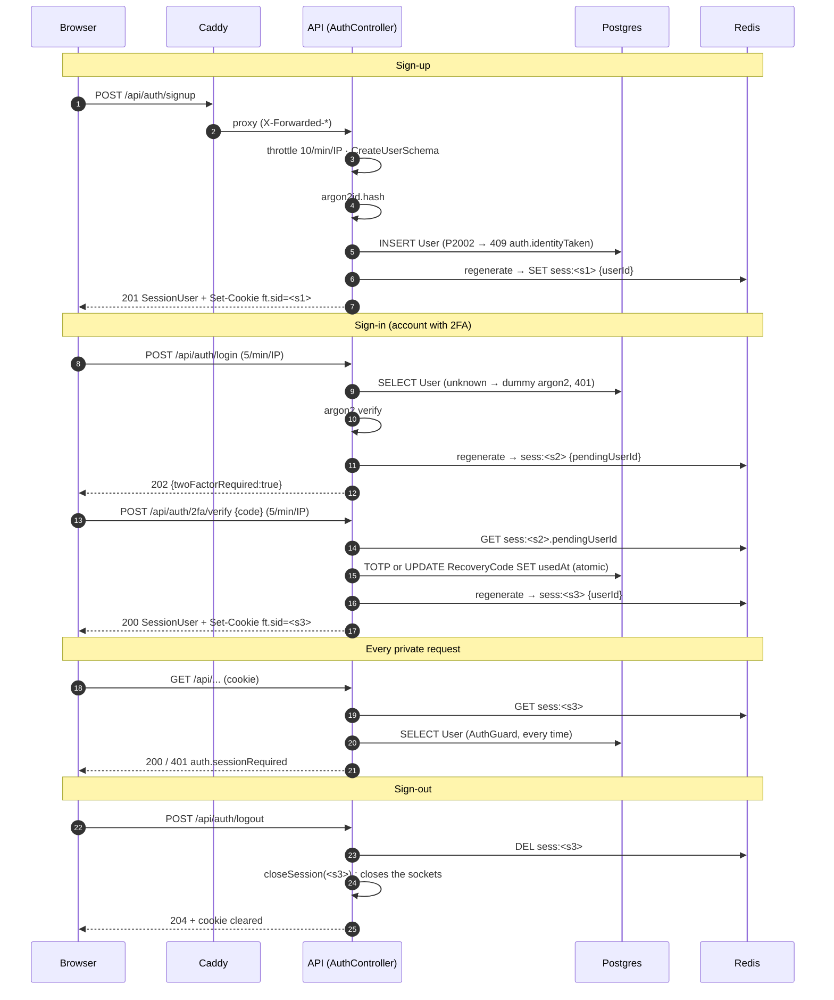
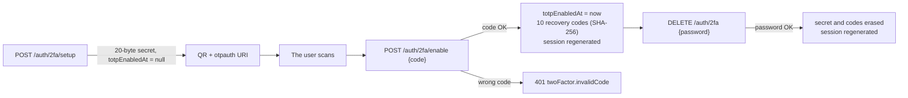

# Diagram · Authentication

## Sign-up, sign-in, 2FA, sign-out

```mermaid
sequenceDiagram
    autonumber
    participant B as Browser
    participant C as Caddy
    participant A as API (AuthController)
    participant P as Postgres
    participant R as Redis

    Note over B,R: Sign-up
    B->>C: POST /api/auth/signup
    C->>A: proxy (X-Forwarded-*)
    A->>A: throttle 10/min/IP · CreateUserSchema
    A->>A: argon2id.hash
    A->>P: INSERT User (P2002 → 409 auth.identityTaken)
    A->>R: regenerate → SET sess:<s1> {userId}
    A-->>B: 201 SessionUser + Set-Cookie ft.sid=<s1>

    Note over B,R: Sign-in (account with 2FA)
    B->>A: POST /api/auth/login (5/min/IP)
    A->>P: SELECT User (unknown → dummy argon2, 401)
    A->>A: argon2.verify
    A->>R: regenerate → sess:<s2> {pendingUserId}
    A-->>B: 202 {twoFactorRequired:true}
    B->>A: POST /api/auth/2fa/verify {code} (5/min/IP)
    A->>R: GET sess:<s2>.pendingUserId
    A->>P: TOTP or UPDATE RecoveryCode SET usedAt (atomic)
    A->>R: regenerate → sess:<s3> {userId}
    A-->>B: 200 SessionUser + Set-Cookie ft.sid=<s3>

    Note over B,R: Every private request
    B->>A: GET /api/... (cookie)
    A->>R: GET sess:<s3>
    A->>P: SELECT User (AuthGuard, every time)
    A-->>B: 200 / 401 auth.sessionRequired

    Note over B,R: Sign-out
    B->>A: POST /api/auth/logout
    A->>R: DEL sess:<s3>
    A->>A: closeSession(<s3>) : closes the sockets
    A-->>B: 204 + cookie cleared
```

## Enabling 2FA

```mermaid
flowchart LR
    s["POST /auth/2fa/setup"] -->|"20-byte secret, totpEnabledAt = null"| qr["QR + otpauth URI"]
    qr --> app["The user scans"]
    app --> e["POST /auth/2fa/enable {code}"]
    e -->|"code OK"| on["totpEnabledAt = now<br/>10 recovery codes (SHA-256)<br/>session regenerated"]
    e -->|"wrong code"| ko["401 twoFactor.invalidCode"]
    on --> d["DELETE /auth/2fa {password}"]
    d -->|"password OK"| off["secret and codes erased<br/>session regenerated"]
```
