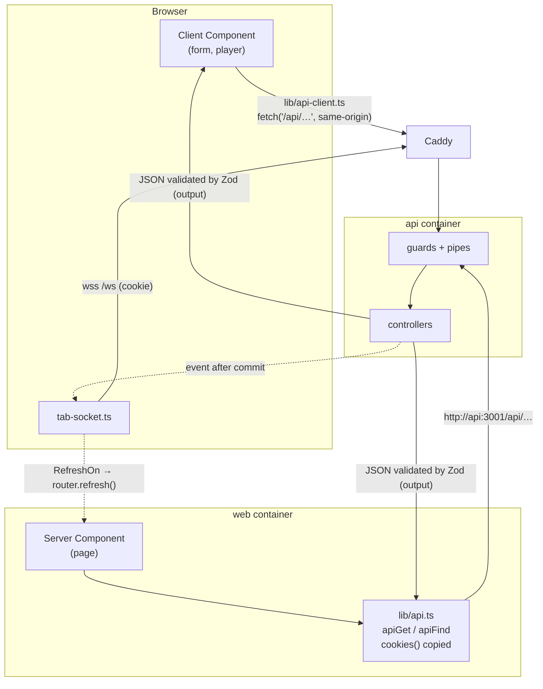
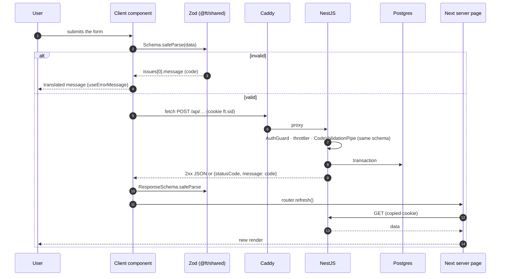

# Diagram · Frontend ↔ backend communication

## The two paths

```mermaid
flowchart TB
    subgraph nav["Browser"]
        cc["Client Component<br/>(form, player)"]
        sock["tab-socket.ts"]
    end
    subgraph next["web container"]
        sc["Server Component<br/>(page)"]
        apits["lib/api.ts<br/>apiGet / apiFind<br/>cookies() copied"]
    end
    subgraph nest["api container"]
        guard["guards + pipes"]
        ctrl["controllers"]
    end
    caddy["Caddy"]

    cc -->|"lib/api-client.ts<br/>fetch('/api/…', same-origin)"| caddy --> guard
    sock -->|"wss /ws (cookie)"| caddy
    sc --> apits -->|"http://api:3001/api/…"| guard
    guard --> ctrl
    ctrl -->|"JSON validated by Zod (output)"| cc
    ctrl -->|"JSON validated by Zod (output)"| apits
    ctrl -.->|"event after commit"| sock
    sock -.->|"RefreshOn → router.refresh()"| sc
```

## A write, end to end

```mermaid
sequenceDiagram
    autonumber
    participant U as User
    participant F as Client component
    participant Z as Zod (@ft/shared)
    participant C as Caddy
    participant N as NestJS
    participant DB as Postgres
    participant S as Next server page
    U->>F: submits the form
    F->>Z: Schema.safeParse(data)
    alt invalid
        Z-->>F: issues[0].message (code)
        F-->>U: translated message (useErrorMessage)
    else valid
        F->>C: fetch POST /api/… (cookie ft.sid)
        C->>N: proxy
        N->>N: AuthGuard · throttler · CodeValidationPipe (same schema)
        N->>DB: transaction
        N-->>F: 2xx JSON or {statusCode, message: code}
        F->>Z: ResponseSchema.safeParse
        F->>S: router.refresh()
        S->>N: GET (copied cookie)
        N-->>S: data
        S-->>U: new render
    end
```
