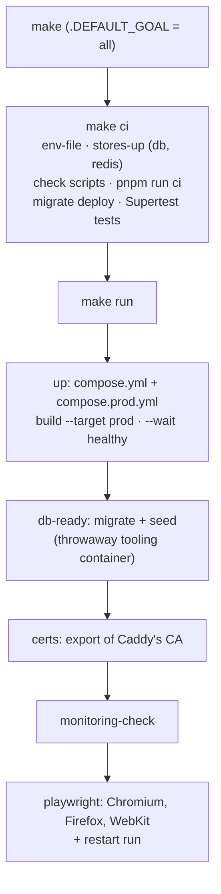
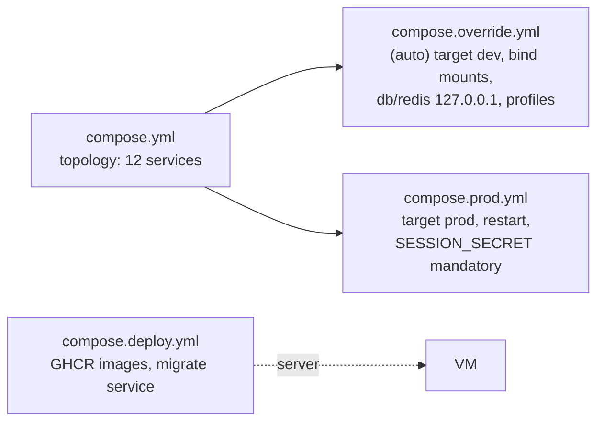
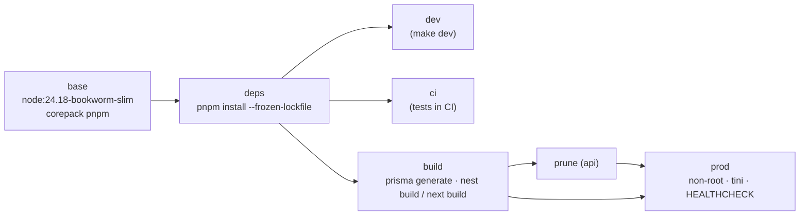
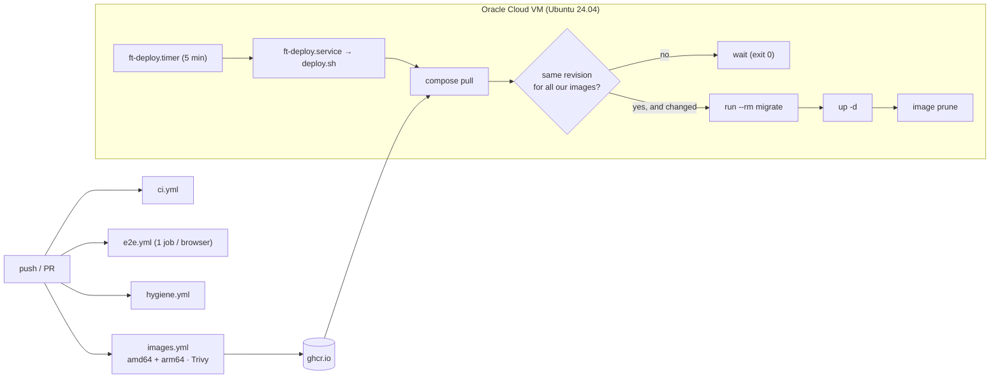

# Diagram · Infrastructure, build and deployment

## What `make` does

```mermaid
flowchart TB
    make["make (.DEFAULT_GOAL = all)"] --> ci["make ci<br/>env-file · stores-up (db, redis)<br/>check scripts · pnpm run ci<br/>migrate deploy · Supertest tests"]
    ci --> run["make run"]
    run --> up["up: compose.yml + compose.prod.yml<br/>build --target prod · --wait healthy"]
    up --> dbready["db-ready: migrate + seed<br/>(throwaway tooling container)"]
    dbready --> certs["certs: export of Caddy's CA"]
    certs --> mon["monitoring-check"]
    mon --> pw["playwright: Chromium, Firefox, WebKit<br/>+ restart run"]
```

## The Compose files

```mermaid
flowchart LR
    base["compose.yml<br/>topology: 12 services"]
    dev["compose.override.yml<br/>(auto) target dev, bind mounts,<br/>db/redis 127.0.0.1, profiles"]
    prod["compose.prod.yml<br/>target prod, restart,<br/>SESSION_SECRET mandatory"]
    deploy["compose.deploy.yml<br/>GHCR images, migrate service"]
    base --> dev
    base --> prod
    deploy -.->|"server"| vm["VM"]
```

## Dockerfile stages

```mermaid
flowchart LR
    b["base<br/>node:24.18-bookworm-slim<br/>corepack pnpm"] --> d["deps<br/>pnpm install --frozen-lockfile"]
    d --> dev["dev<br/>(make dev)"]
    d --> ci["ci<br/>(tests in CI)"]
    d --> bu["build<br/>prisma generate · nest build / next build"]
    bu --> pr["prune (api)"]
    pr --> prod["prod<br/>non-root · tini · HEALTHCHECK"]
    bu --> prod
```

## CI/CD and deployment

```mermaid
flowchart LR
    push["push / PR"] --> ci["ci.yml"]
    push --> e2e["e2e.yml (1 job / browser)"]
    push --> hyg["hygiene.yml"]
    push --> img["images.yml<br/>amd64 + arm64 · Trivy"]
    img --> ghcr[("ghcr.io")]
    subgraph vm["Oracle Cloud VM (Ubuntu 24.04)"]
        timer["ft-deploy.timer (5 min)"] --> svc["ft-deploy.service → deploy.sh"]
        svc --> pull["compose pull"]
        pull --> same{"same revision<br/>for all our images?"}
        same -->|"no"| wait["wait (exit 0)"]
        same -->|"yes, and changed"| mig["run --rm migrate"] --> upd["up -d"] --> prune["image prune"]
    end
    ghcr --> pull
```
