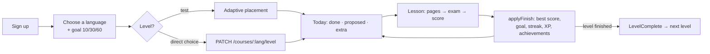
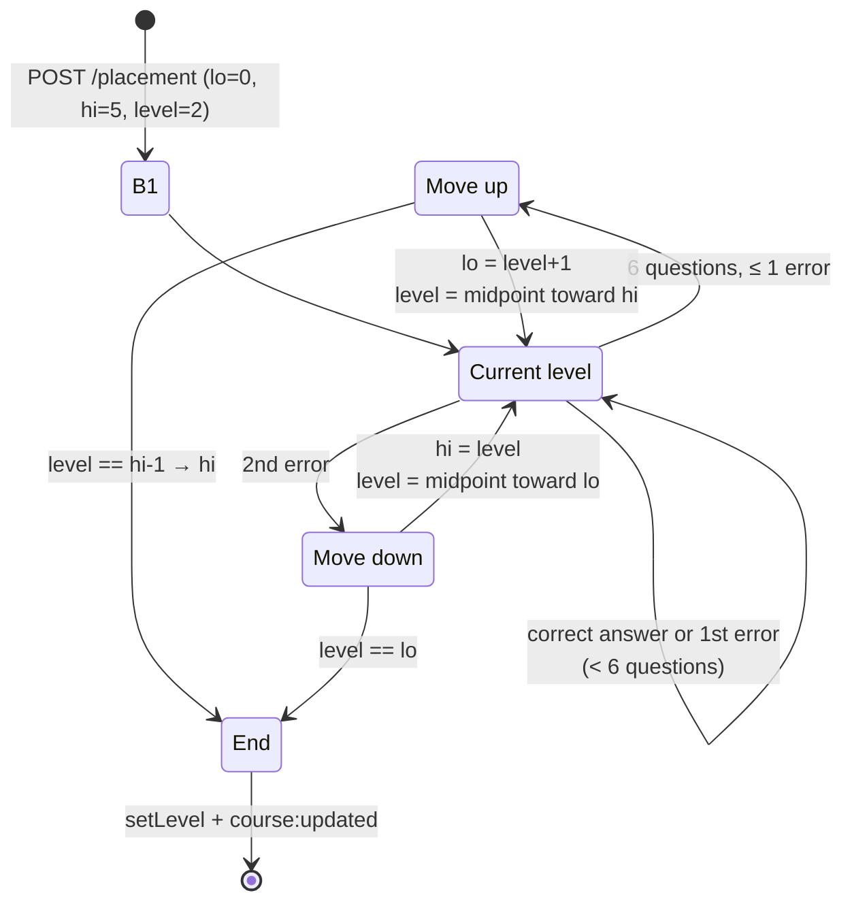
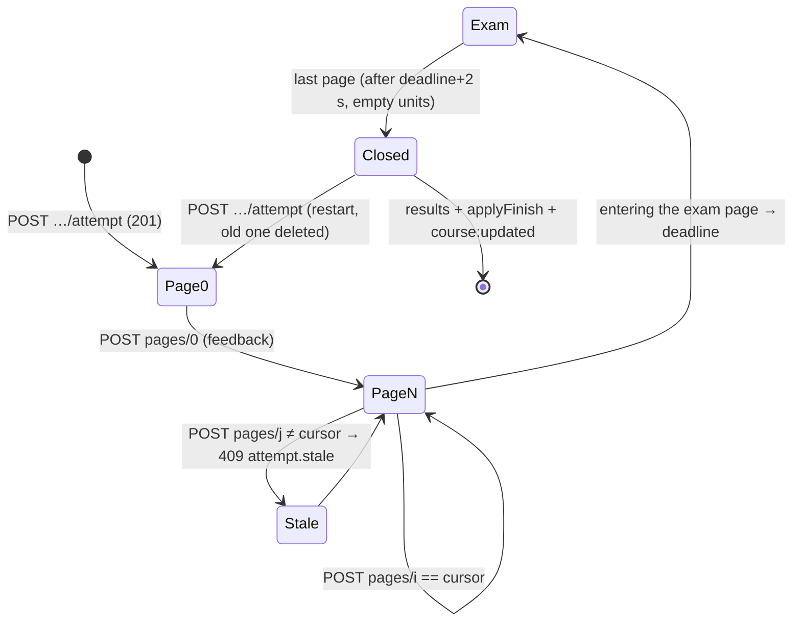
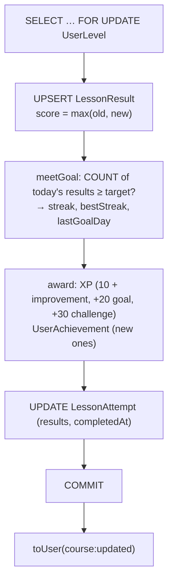
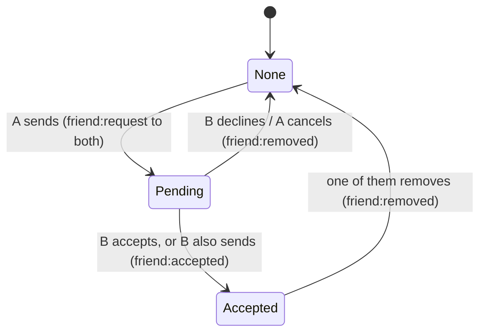

# Diagram · Main feature flows

## The learner journey

```mermaid
flowchart LR
    signup["Sign up"] --> course["Choose a language<br/>+ goal 10/30/60"]
    course --> lvl{"Level?"}
    lvl -->|"test"| place["Adaptive placement"]
    lvl -->|"direct choice"| set["PATCH /courses/:lang/level"]
    place --> today["Today: done · proposed · extra"]
    set --> today
    today --> play["Lesson: pages → exam → score"]
    play --> finish["applyFinish: best score,<br/>goal, streak, XP, achievements"]
    finish --> today
    finish -->|"level finished"| next["LevelComplete → next level"]
```

## Placement (state machine)

```mermaid
stateDiagram-v2
    state "Move up" as Monter
    state "Move down" as Descendre
    state "End" as Fin
    [*] --> B1: POST /placement (lo=0, hi=5, level=2)
    state "Current level" as cur
    B1 --> cur
    cur --> cur: correct answer or 1st error<br/>(< 6 questions)
    cur --> Monter: 6 questions, ≤ 1 error
    cur --> Descendre: 2nd error
    Monter --> Fin: level == hi-1 → hi
    Monter --> cur: lo = level+1<br/>level = midpoint toward hi
    Descendre --> Fin: level == lo
    Descendre --> cur: hi = level<br/>level = midpoint toward lo
    Fin --> [*]: setLevel + course#58;updated
```

## A lesson attempt

```mermaid
stateDiagram-v2
    state "Exam" as Examen
    state "Closed" as Clos
    [*] --> Page0: POST …/attempt (201)
    Page0 --> PageN: POST pages/0 (feedback)
    PageN --> PageN: POST pages/i == cursor
    PageN --> Stale: POST pages/j ≠ cursor → 409 attempt.stale
    Stale --> PageN
    PageN --> Examen: entering the exam page → deadline
    Examen --> Clos: last page (after deadline+2 s, empty units)
    Clos --> [*]: results + applyFinish + course#58;updated
    Clos --> Page0: POST …/attempt (restart, old one deleted)
```

## End of a lesson: what is written, in a single transaction

```mermaid
flowchart TB
    lock["SELECT … FOR UPDATE UserLevel"] --> res["UPSERT LessonResult<br/>score = max(old, new)"]
    res --> goal["meetGoal: COUNT of today's results ≥ target?<br/>→ streak, bestStreak, lastGoalDay"]
    goal --> award["award: XP (10 + improvement, +20 goal, +30 challenge)<br/>UserAchievement (new ones)"]
    award --> att["UPDATE LessonAttempt (results, completedAt)"]
    att --> commit["COMMIT"]
    commit --> ev["toUser(course:updated)"]
```

## Friendship

```mermaid
stateDiagram-v2
    state "None" as Aucune
    [*] --> Aucune
    Aucune --> Pending: A sends (friend#58;request to both)
    Pending --> Accepted: B accepts, or B also sends (friend#58;accepted)
    Pending --> Aucune: B declines / A cancels (friend#58;removed)
    Accepted --> Aucune: one of them removes (friend#58;removed)
```
