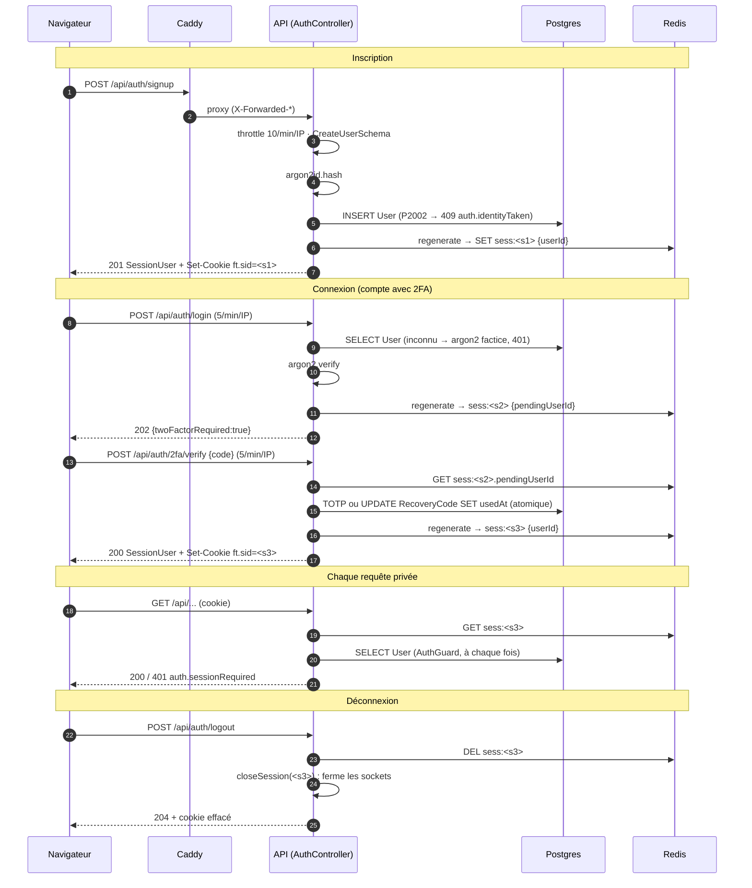
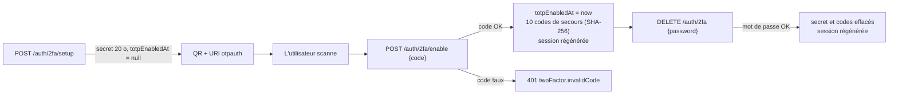

# Diagramme · Authentification

## Inscription, connexion, 2FA, déconnexion

```mermaid
sequenceDiagram
    autonumber
    participant B as Navigateur
    participant C as Caddy
    participant A as API (AuthController)
    participant P as Postgres
    participant R as Redis

    Note over B,R: Inscription
    B->>C: POST /api/auth/signup
    C->>A: proxy (X-Forwarded-*)
    A->>A: throttle 10/min/IP · CreateUserSchema
    A->>A: argon2id.hash
    A->>P: INSERT User (P2002 → 409 auth.identityTaken)
    A->>R: regenerate → SET sess:<s1> {userId}
    A-->>B: 201 SessionUser + Set-Cookie ft.sid=<s1>

    Note over B,R: Connexion (compte avec 2FA)
    B->>A: POST /api/auth/login (5/min/IP)
    A->>P: SELECT User (inconnu → argon2 factice, 401)
    A->>A: argon2.verify
    A->>R: regenerate → sess:<s2> {pendingUserId}
    A-->>B: 202 {twoFactorRequired:true}
    B->>A: POST /api/auth/2fa/verify {code} (5/min/IP)
    A->>R: GET sess:<s2>.pendingUserId
    A->>P: TOTP ou UPDATE RecoveryCode SET usedAt (atomique)
    A->>R: regenerate → sess:<s3> {userId}
    A-->>B: 200 SessionUser + Set-Cookie ft.sid=<s3>

    Note over B,R: Chaque requête privée
    B->>A: GET /api/... (cookie)
    A->>R: GET sess:<s3>
    A->>P: SELECT User (AuthGuard, à chaque fois)
    A-->>B: 200 / 401 auth.sessionRequired

    Note over B,R: Déconnexion
    B->>A: POST /api/auth/logout
    A->>R: DEL sess:<s3>
    A->>A: closeSession(<s3>) : ferme les sockets
    A-->>B: 204 + cookie effacé
```

## Activer la 2FA

```mermaid
flowchart LR
    s["POST /auth/2fa/setup"] -->|"secret 20 o, totpEnabledAt = null"| qr["QR + URI otpauth"]
    qr --> app["L'utilisateur scanne"]
    app --> e["POST /auth/2fa/enable {code}"]
    e -->|"code OK"| on["totpEnabledAt = now<br/>10 codes de secours (SHA-256)<br/>session régénérée"]
    e -->|"code faux"| ko["401 twoFactor.invalidCode"]
    on --> d["DELETE /auth/2fa {password}"]
    d -->|"mot de passe OK"| off["secret et codes effacés<br/>session régénérée"]
```
