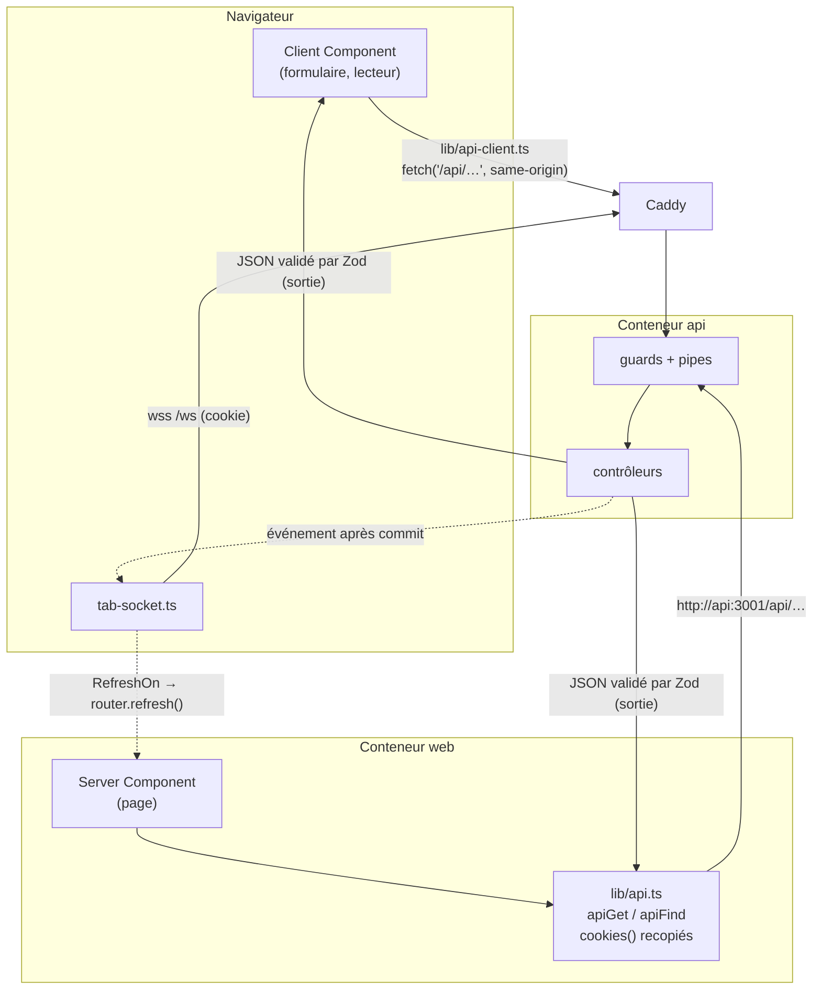
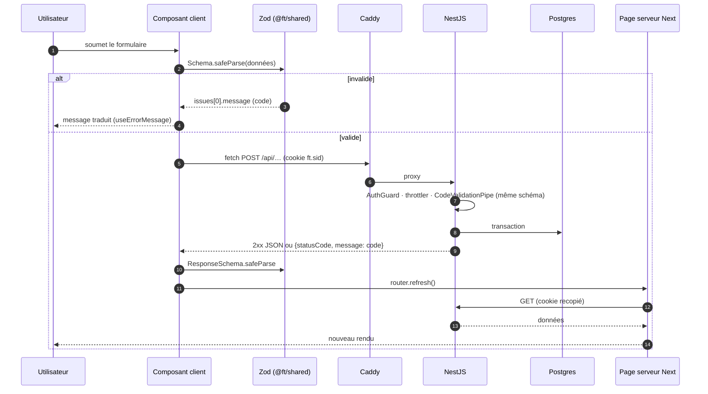

# Diagramme · Communication frontend ↔ backend

## Les deux chemins

```mermaid
flowchart TB
    subgraph nav["Navigateur"]
        cc["Client Component<br/>(formulaire, lecteur)"]
        sock["tab-socket.ts"]
    end
    subgraph next["Conteneur web"]
        sc["Server Component<br/>(page)"]
        apits["lib/api.ts<br/>apiGet / apiFind<br/>cookies() recopiés"]
    end
    subgraph nest["Conteneur api"]
        guard["guards + pipes"]
        ctrl["contrôleurs"]
    end
    caddy["Caddy"]

    cc -->|"lib/api-client.ts<br/>fetch('/api/…', same-origin)"| caddy --> guard
    sock -->|"wss /ws (cookie)"| caddy
    sc --> apits -->|"http://api:3001/api/…"| guard
    guard --> ctrl
    ctrl -->|"JSON validé par Zod (sortie)"| cc
    ctrl -->|"JSON validé par Zod (sortie)"| apits
    ctrl -.->|"événement après commit"| sock
    sock -.->|"RefreshOn → router.refresh()"| sc
```

## Une écriture, de bout en bout

```mermaid
sequenceDiagram
    autonumber
    participant U as Utilisateur
    participant F as Composant client
    participant Z as Zod (@ft/shared)
    participant C as Caddy
    participant N as NestJS
    participant DB as Postgres
    participant S as Page serveur Next
    U->>F: soumet le formulaire
    F->>Z: Schema.safeParse(données)
    alt invalide
        Z-->>F: issues[0].message (code)
        F-->>U: message traduit (useErrorMessage)
    else valide
        F->>C: fetch POST /api/… (cookie ft.sid)
        C->>N: proxy
        N->>N: AuthGuard · throttler · CodeValidationPipe (même schéma)
        N->>DB: transaction
        N-->>F: 2xx JSON ou {statusCode, message: code}
        F->>Z: ResponseSchema.safeParse
        F->>S: router.refresh()
        S->>N: GET (cookie recopié)
        N-->>S: données
        S-->>U: nouveau rendu
    end
```
