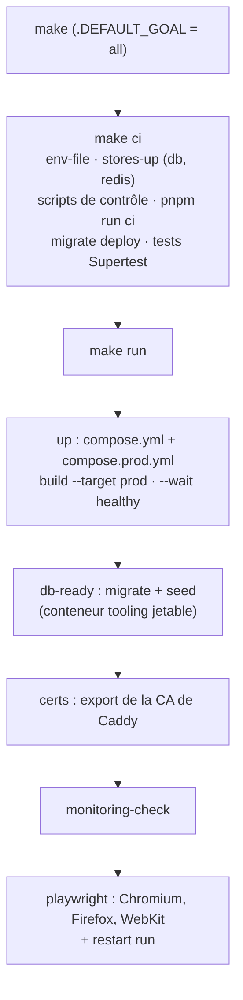
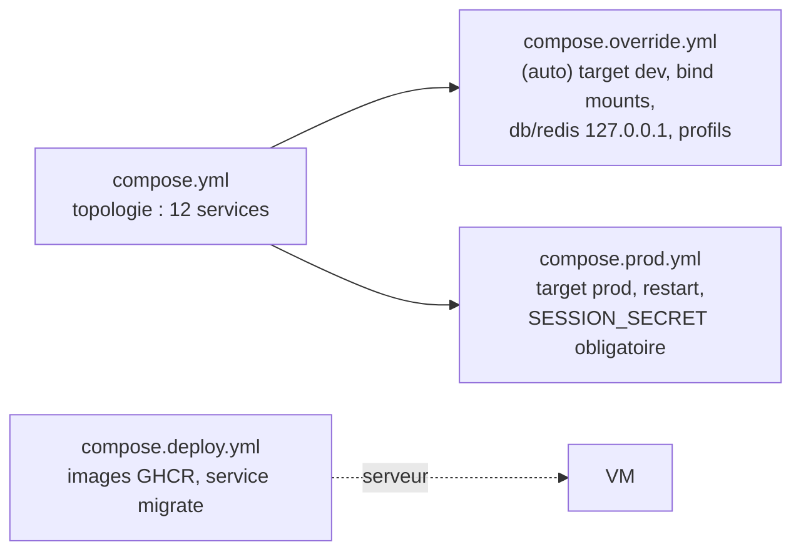
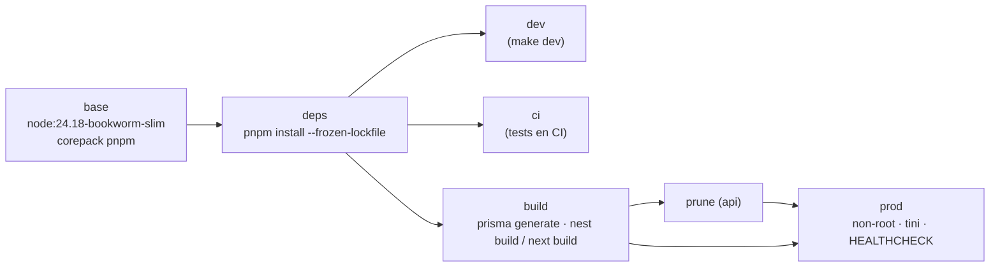
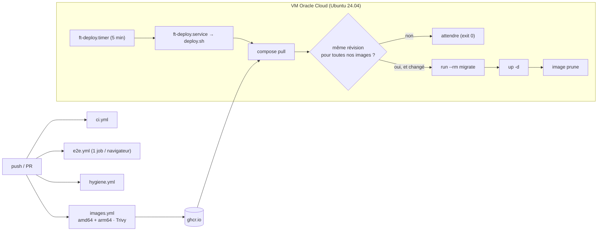

# Diagramme · Infrastructure, build et déploiement

## Ce que fait `make`

```mermaid
flowchart TB
    make["make (.DEFAULT_GOAL = all)"] --> ci["make ci<br/>env-file · stores-up (db, redis)<br/>scripts de contrôle · pnpm run ci<br/>migrate deploy · tests Supertest"]
    ci --> run["make run"]
    run --> up["up : compose.yml + compose.prod.yml<br/>build --target prod · --wait healthy"]
    up --> dbready["db-ready : migrate + seed<br/>(conteneur tooling jetable)"]
    dbready --> certs["certs : export de la CA de Caddy"]
    certs --> mon["monitoring-check"]
    mon --> pw["playwright : Chromium, Firefox, WebKit<br/>+ restart run"]
```

## Les fichiers Compose

```mermaid
flowchart LR
    base["compose.yml<br/>topologie : 12 services"]
    dev["compose.override.yml<br/>(auto) target dev, bind mounts,<br/>db/redis 127.0.0.1, profils"]
    prod["compose.prod.yml<br/>target prod, restart,<br/>SESSION_SECRET obligatoire"]
    deploy["compose.deploy.yml<br/>images GHCR, service migrate"]
    base --> dev
    base --> prod
    deploy -.->|"serveur"| vm["VM"]
```

## Étapes des Dockerfiles

```mermaid
flowchart LR
    b["base<br/>node:24.18-bookworm-slim<br/>corepack pnpm"] --> d["deps<br/>pnpm install --frozen-lockfile"]
    d --> dev["dev<br/>(make dev)"]
    d --> ci["ci<br/>(tests en CI)"]
    d --> bu["build<br/>prisma generate · nest build / next build"]
    bu --> pr["prune (api)"]
    pr --> prod["prod<br/>non-root · tini · HEALTHCHECK"]
    bu --> prod
```

## CI/CD et déploiement

```mermaid
flowchart LR
    push["push / PR"] --> ci["ci.yml"]
    push --> e2e["e2e.yml (1 job / navigateur)"]
    push --> hyg["hygiene.yml"]
    push --> img["images.yml<br/>amd64 + arm64 · Trivy"]
    img --> ghcr[("ghcr.io")]
    subgraph vm["VM Oracle Cloud (Ubuntu 24.04)"]
        timer["ft-deploy.timer (5 min)"] --> svc["ft-deploy.service → deploy.sh"]
        svc --> pull["compose pull"]
        pull --> same{"même révision<br/>pour toutes nos images ?"}
        same -->|"non"| wait["attendre (exit 0)"]
        same -->|"oui, et changé"| mig["run --rm migrate"] --> upd["up -d"] --> prune["image prune"]
    end
    ghcr --> pull
```
